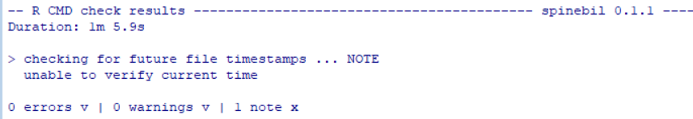
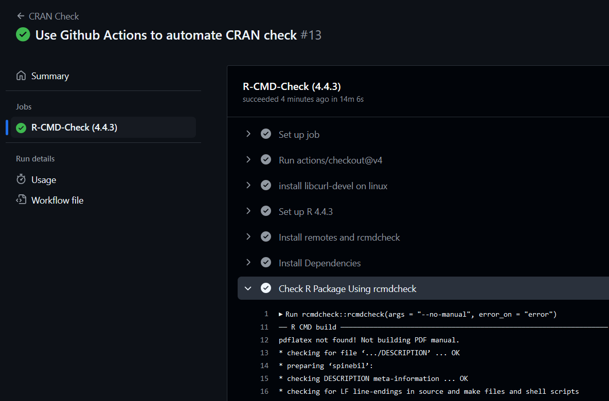

```{r setup, include=FALSE}
knitr::opts_chunk$set(echo = TRUE)
```

## Environments

-   Windows 10 x64 Version 1809(LTS)
-   Git 2.49.0
-   R 4.4.3 (The latest version as of March 2025)
-   Rtools 4.4.6459 (The latest version as of March 2025)
-   RStudio 2024.12.1+563

To get prepared for `spinebil`, multiple R packages are required, by running the following command:

``` r
# for checking the code and install from GitHub
install.packages('devtools')

# for running spinebil
devtools::install_github('cran/binostics')
devtools::install_deps(dependencies = TRUE)

# (optional) for knitting pdf
tinytex::install_tinytex()
```

## Easy Test

> Fork the package and run the package checks using devtools. Make the fixes needed for it to pass CRAN checks.

A fork of [the latest version of the original package](https://github.com/uschiLaa/spinebil/commit/6963c45af13efe834f445f2b404c6d40ac1a41e2) has been created [on GitHub](https://github.com/circle2red/spinebil). Then it is cloned to local.

``` bash
git clone https://github.com/circle2red/spinebil
```

To check, following R code is executed:

``` r
setwd('spinebil')
devtools::check()
```

The check resulted in an error in `compareSmoothing()` (smoothing.R). After some investigation, the error is in the `getIndexMean()` function.

-   The variable `orig` is a 1x1 dataframe instead of a numeric value;
-   The variable `valVec` is a list instead of a numeric vector.

These resulting in n/a in the further `mean()` function and further `tibble::add_row()` functions.

The solution would be simple: add a `as.numeric()` wrap around the `orig`, and add a `unlist()` wrap around the `valVec`.

The whole modified `getIndexMean()` function would be:

``` r
getIndexMean <- function(proj, d, alpha, idx, method="jitterAngle", n=10){
  dProj <- d %*% proj
  orig <- as.numeric(idx(dProj))
  if(method == "jitterAngle"){
    valVec <- replicate(n, jitterAngle(proj, d, alpha, idx))
  } else if (method=="jitterPoints"){
    valVec <- replicate(n, jitterPoints(dProj, alpha, idx))
  }
  else { return(orig)}
  valVec <- unlist(valVec)
  return(mean(c(orig, valVec)))
}
```

Another error occurred in `profileRotation()` (roration.R). It is also because of datatypes.

-   The assignment of `resMat[i,]` requires a vector, but provided a list.

It can then be fixed by wrapping the `c(res, a)` with another `unlist()`, the whole modified function would be:

``` r
profileRotation <- function(d, indexList, indexLabels, n=200){
  # initialise results storage
  resMat <- matrix(ncol = length(indexLabels)+1, nrow = n+1)
  colnames(resMat) <- c(indexLabels, "alpha")

  # loop over rotation angles
  i <- 1
  for (a in seq(0,2*pi, 2*pi/n)){
    rotM <- matrix(c(cos(a), sin(a), -sin(a), cos(a)), ncol = 2)
    dprj <- d %*% rotM
    res <- c()
    for (idx in indexList){
      res <- c(res, idx(dprj))
    }
    resMat[i,] <- unlist(c(res, a))
    i <- i+1
  }
  resMat
}
```

There is another error in `timeSequence()` (timer.R). The unlisted variable `unlist(tictoc::tic.log(format=FALSE))` with the index of `["toc.elapsed"]` and `["tic.elapsed"]` is not a numeric value (it is a "character" variable instead), thus it can not be subtracted. It can be solved with wrapping `as.numeric()` with the log.

``` r
timeSequence <- function(d, t, idx, pmax){
  i <- 1
  dfTimer <- data.frame(t= numeric(), i=numeric())
  for(pMatrix in t){
    if(i>pmax) break
    tictoc::tic.clearlog()
    tictoc::tic() #start timer
    dProj <- d %*% pMatrix
    res <- idx(dProj)
    tictoc::toc(log=TRUE,quiet=TRUE)
    resT <- as.numeric(unlist(tictoc::tic.log(format=FALSE))["toc.elapsed"]) -
      as.numeric(unlist(tictoc::tic.log(format=FALSE))["tic.elapsed"])
    dfTimer <- tibble::add_row(dfTimer, t=resT, i=i)
    i <- i+1
  }
  return(dfTimer)
}
```

After those fixes, a run resulted in 0 errors and 0 warnings. There were one note, because the timestamp servers can not be accessed at this moment.

```         
N  checking for future file timestamps (2.4s)
   unable to verify current time
```




## Medium Test

> Medium: Add a GitHub Actions workflow to automate the CRAN checks when code is pushed to the GitHub.

This can be achieved by following the [official guide](https://docs.github.com/en/actions/use-cases-and-examples/creating-an-example-workflow) of GitHub Actions. It also requires reading documents of the [GitHub Actions for the R language Repository](https://github.com/r-lib/actions).

There are two tricky part in the process.

1.  The `binostics` package which can not be found by default `install.packages()`.\

-   This can be solved using a separate call to `remotes::install_github('cran/binostics')`.
-   This also resulted in not being able to use the official `r-lib/actions/setup-r-dependencies@v2/`, for it would fail on this dependency.

2.  The `rcmdcheck` would fail on installation if not using the official dependency setup script.

-   By having a little research, this is due to lack of a Linux library. This can be fixed by executing `apt-get install libcurl4-openssl-dev` at the beginning.

By writing a .yaml file in `.github/workflows` and push to GitHub, it will now automate the CRAN Checking process.



The script can be further improved in the following ways:

1.  Utilize the GitHub Actions Cache to avoid compiling libraries each run. Currently, each run takes \~10mins, which is a bit long.

2.  Add more platforms to test. Currently I only tested the generic Ubuntu image, more OSes can be added.


## Hard Test

> Hard: Write a simulation to check the minimum and maximum values that we might observe for any 2D pattern for the stringy index available in tourr package. Report the data generated for testing, and the minimum and maximum values that would be expected.

First we list all available objects in package `tourr` using `ls("package:tourr")`. It turns out that the `stringy()`  would help. By checking its usage, we found calling `tourr::stringy()` returns another callable that refers to `cassowaryr::sc_stringy()`. 

This method computes stringy scagnostic measure using MST. From its example, we can see how the `stringy index` works:

```{R include=FALSE}
require(cassowaryr)
require(ggplot2)
require(tidyr)
require(dplyr)
data(anscombe_tidy)
```

```{R echo=FALSE}
labeller <- function(value) {
  return(data.frame(
    set=c(paste("Stringy Index = ", sc_stringy(anscombe$x1, anscombe$y1)),
          paste("Stringy Index = ", sc_stringy(anscombe$x2, anscombe$y2)),
          paste("Stringy Index = ", sc_stringy(anscombe$x3, anscombe$y3)),
          paste("Stringy Index = ", sc_stringy(anscombe$x4, anscombe$y4))
    )
  ))
}

ggplot(anscombe_tidy, aes(x=x, y=y)) +
  geom_point() +
  facet_wrap(~set, ncol=2, scales = "free", labeller = labeller)
```

It is also worth noticing that, by calling `tourr::stringy()`, it returns a callable, which takes a 2-column matrix (which represents a series of points, x and y) as the only parameter:

```{R}
tourr::stringy()
```

The example usage would be:

```{R}
set.seed(42)

# the sample cassowaryr library uses 11 points.
mat <- matrix(runif(11 * 2), ncol=2) 

# display the stringy index
tourr::stringy()(mat)  # note the extra parenthesis

# display the graph
plot(x=mat[,1], y=mat[,2])
```


We therefore write the following simulation code.
```{R}
max_value <- -Inf
min_value <- Inf
max_mat <- NULL
min_mat <- NULL

for (i in 1:3000) {
  mat <- matrix(runif(15 * 2), ncol = 2)
  
  s_index <- tourr::stringy()(mat)
  
  if (s_index > max_value) {
    max_value <- s_index
    max_mat <- mat
  }
  
  if (s_index < min_value) {
    min_value <- s_index
    min_mat <- mat
  }
}

max_df <- as.data.frame(max_mat)
min_df <- as.data.frame(min_mat)

max_df$label <- paste("Max stringy index = ", max_value)
min_df$label <- paste("Min stringy index = ", min_value)

df <- bind_rows(max_df, min_df)

ggplot(df, aes(x = V1, y = V2)) +
  geom_point() +
  facet_wrap(~label, scales = "free", ncol = 2) + 
  theme_minimal()
```


